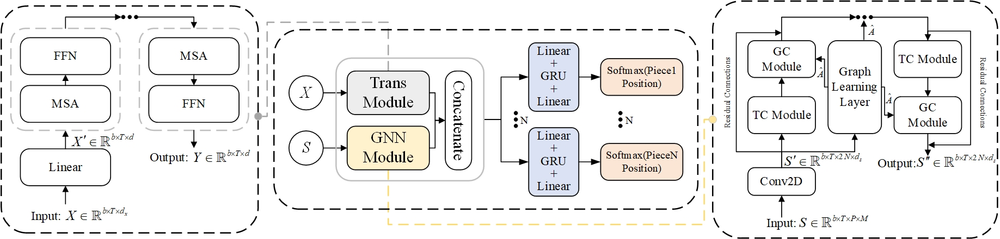

# ELP-Net
The code for the paper “Enhanced Location Prediction for Wargaming with Graph Neural Networks and Transformers”.


**Framework of ELP-Net for wargaming.**

## Dataset
The dataset comes from **<http://www.hexwar.cn/>**

### *Preprocessing*
Data preprocessing follows the method of  **<[Liu et al](https://github.com/daman043/AAGWS-Wargame-master.git)>**

### *Parsing Replays*
change the directory to ./ELP-Net-master/parse_extract_feartures/, and run
```
python parse_extract_feature.py
```
**The result will save in ./ELP-Net-master/data/feature_data**

### *Split dataset*
change the directory to ./ELP-Net-master/parse_extract_feartures/, and run
```
python split.py
```
**The result will save in ./ELP-Net-master/data/train_test**

## Experiment
### *Model*
the network in ./ELP-Net-master/Baselines/Net

### *Training*
change the directory to ./ELP-Net-master/Baselines/EnemyPositionPrediction/, and run
```
python train.py --net_name ELP --phrase train
```
The train result will be save in ./ELP-Net-master/Baselines/EnemyPositionPrediction/checkpoints/

### *Testing*
change the directory to ./ELP-Net-master/Baselines/EnemyPositionPrediction/, and run
```
python train.py --net_name ELP --phrase test
```
The test result will be save in ./ELP-Net-master/Baselines/EnemyPositionPrediction/checkpoints/ELPNet/all

### *Testing the best model*

```
python train.py --net_name CNN_MSA_GRU --phrase test_pro
```
The test_pro result will be save in ./ELP-Net-master/Baselines/EnemyPositionPrediction/checkpoints/ELPNet/all

### *plot*
Plot the all results in ./ELP-Net-master/plot, and run *result_plot_ipynb* with jupyter notebook

## Requirements
python == 3.10

torch == 2.1.2

pandas == 2.2.2

numpy == 1.26.4

scipy == 1.13.1

tqdm == 4.66.4

matplotlib == 3.8.4

Pillow == 10.4.0


## Cite
If you find this code useful, please consider citing the original work by authors
```
  author={Junliang Li, Dingge Liang},
  Code Availability
  The source code associated with this project will be made publicly available upon the acceptance of our paper.
  For more details, you can access the paper here: title={Enhanced Location Prediction for Wargaming with Graph Neural Networks and Transformers}
}
```
